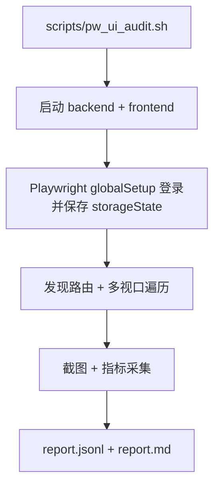

# 变更提案: playwright-ui-audit

## 元信息
```yaml
类型: 优化
方案类型: implementation
优先级: P0
状态: 已完成
创建: 2026-02-16
```

---

## 1. 需求

### 背景
近期你对项目前端做了较多样式与布局调整，导致多个页面出现按钮不对齐、内容被裁切/显示不全、布局错位等问题。
目前靠人工逐页打开排查效率低且容易漏页，因此需要一个“可重复、可回归”的 UI 巡检手段：自动遍历所有路由、在多设备/分辨率下截图，并输出问题清单与对应截图，作为后续逐项修复的依据。

### 目标
1. 基于 Playwright（仅 Chromium）实现“全站 UI 巡检”能力：覆盖所有页面、覆盖多设备/分辨率、支持登录态页面。
2. 首先交付“问题清单 + 对应截图”（你选择的 B 流程），随后再根据清单逐项修复并回归复测。
3. 巡检结果落盘到统一目录，便于对比与追踪：`output/playwright/ui-audit/<timestamp>/`。

### 约束条件
```yaml
时间约束: 无（优先保证可重复、可回归）
性能约束: 单次巡检在本机可接受（默认 workers=1；页面约 10；视口约 6；预计数分钟级）
兼容性约束:
  - 浏览器: Chromium
  - 前端: Next.js App Router（当前 `frontend/`）
  - 允许通过环境变量覆盖 baseURL / 端口 / 视口集合
业务约束:
  - 需要登录态覆盖 `/`、`/billing`、`/settings/codex`、`/admin/*` 等页面
  - 默认使用后端自举 admin 账号（可通过环境变量覆盖）
```

### 验收标准
- [ ] 可通过单一命令运行 UI 巡检（推荐 `scripts/pw_ui_audit.sh`），并产出目录 `output/playwright/ui-audit/<timestamp>/`。
- [ ] 每个“可访问页面”在每个视口至少产出 1 张截图（建议同时输出 viewport + fullPage 两张）。
- [ ] 自动生成 `report.md`：按“页面 × 视口”列出访问结果、基础指标（如是否存在水平溢出）、以及对应截图路径。
- [ ] 对动态路由（当前仅 `/jobs/[jobId]`）若无法自动解析参数，必须在报告中标记跳过原因，并提示如何补齐（如设置 `REALMOI_PW_JOB_ID` 或先创建 Job）。
- [ ] 巡检工具本身不要求“修复 UI”；后续修复以报告为输入，经确认后执行。

---

## 2. 方案

### 技术方案
采用方案 1：在 `frontend/` 内引入 `@playwright/test` 作为 E2E/巡检基建，新增“UI Audit”测试用例来：
- 自动发现前端页面路由（扫描 `frontend/src/app/**/page.tsx` 并转换为路由；忽略 route group 段 `(xxx)`）。
- 以“代表性视口集合”覆盖“多设备/分辨率”（默认提供一组常用手机/平板/桌面尺寸，并支持环境变量覆盖）。
- 通过 globalSetup 登录并写入 `storageState`（默认使用 dev 自举的 admin 账号），确保可访问需要鉴权的页面。
- 对每个页面执行：
  - `page.goto()` + 等待稳定（禁用动画/过渡，避免抖动）
  - 采集基础布局指标（如 `scrollWidth > clientWidth` 的水平溢出）并抓取可能的溢出 offender 列表（Top N）
  - 输出截图到 `output/playwright/ui-audit/<timestamp>/...`
- 将所有页面的结果聚合为 `report.jsonl`（逐条记录）与 `report.md`（面向人工阅读的问题清单+截图索引）。

运行方式：
- 推荐提供 `scripts/pw_ui_audit.sh`：负责启动后端/前端、等待就绪、设置输出目录与环境变量、运行 `npx playwright test`、收集日志并清理进程。

### 影响范围
```yaml
涉及模块:
  - frontend: 新增 Playwright 配置/用例/报告生成逻辑，补充运行脚本
  - scripts: 新增一键巡检脚本（启动服务 + 跑巡检）
  - helloagents(知识库): 记录新增巡检能力与使用方式（开发实施阶段同步）
预计变更文件: 6-12
```

### 风险评估
| 风险 | 等级 | 应对 |
|------|------|------|
| Playwright 首次安装需要下载 Chromium | 中 | 提供 `npx playwright install chromium` 指引；脚本内检测并自动安装（可跳过） |
| Next dev 模式截图不稳定（动画/加载抖动） | 中 | 禁用动画/过渡；为关键页面增加等待条件；必要时支持切换到 `next start` |
| 登录流程或 token 存储逻辑变动导致巡检失败 | 中 | globalSetup 只依赖 `/login` 表单字段（`name=username/password`）；失败时在报告中明确记录 |
| 动态路由缺少参数（`/jobs/[jobId]`）导致覆盖不全 | 低 | 自动尝试从 `/api/jobs` 获取最新 job_id；仍失败则报告跳过并提示设置 `REALMOI_PW_JOB_ID` |

---

## 3. 技术设计（可选）

> 涉及架构变更、API设计、数据模型变更时填写

### 架构设计


### API设计
#### GET /api/jobs（用于解析 /jobs/[jobId] 参数）
- **请求**: `Authorization: Bearer <token>`
- **响应**: `{ items: [{ job_id, ... }], total }`

### 数据模型
| 字段 | 类型 | 说明 |
|------|------|------|
| route | string | 路由（如 `/admin/users`） |
| project | string | 视口/设备项目名（如 `desktop-1440`、`iphone-13`） |
| viewport | object | `{ width, height }` |
| url | string | 实际访问 URL |
| status | string | `ok` / `error` / `skipped` |
| metrics | object | 基础布局指标（如水平溢出、scrollWidth/clientWidth 等） |
| screenshots | object | 截图文件相对路径（viewport/fullPage） |

---

## 4. 核心场景

> 执行完成后同步到对应模块文档

### 场景: 运行 UI 巡检并生成报告
**模块**: frontend / scripts
**条件**:
- 本地可启动 `backend` 与 `frontend`
- 存在可登录账号（默认使用 dev 自举 admin）
**行为**:
- 运行 `scripts/pw_ui_audit.sh`
- 自动启动服务并对全站路由在多视口下截图
- 汇总生成 `report.md`
**结果**:
- 产生可阅读的问题清单（含截图索引），为后续修复提供输入
  

---

## 5. 技术决策

> 本方案涉及的技术决策，归档后成为决策的唯一完整记录

### playwright-ui-audit#D001: 采用 @playwright/test 作为 UI 巡检基建
**日期**: 2026-02-16
**状态**: ✅采纳
**背景**: 需要“可重复 + 可回归”的全站截图巡检能力，且后续要支持多视口、登录态、报告聚合与复测。
**选项分析**:
| 选项 | 优点 | 缺点 |
|------|------|------|
| A: `@playwright/test`（方案 1） | 生态成熟、配置与报告能力强、后续可进入 CI | 首次安装需下载浏览器，脚手架文件略多 |
| B: 纯 Node 脚本（方案 2） | 轻量、上手快 | 报告/并发/复测能力弱，后续维护成本更高 |
| C: playwright-python（方案 3） | 可与后端测试体系合流 | 引入与维护成本最高，对前端改动不友好 |
**决策**: 选择方案 1
**理由**: 在“全站覆盖 + 多视口 + 登录态 + 报告聚合 + 可回归”维度下最省心，且与前端工程天然贴合。
**影响**: `frontend/` 将新增 Playwright 配置与用例；`scripts/` 新增一键巡检脚本；知识库补充使用说明。
