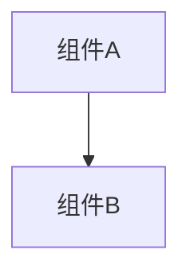

# 变更提案: fix-make-dev

## 元信息
```yaml
类型: 修复
方案类型: implementation
优先级: P0
状态: ✅通过
创建: 2026-02-24
```

---

## 1. 需求

### 背景
本地开发时，`make dev` 会在后端端口被占用时“半启动”：后端启动失败但前端仍继续启动，同时独立 judge 守护进程在后端未就绪时可能因为 WebSocket 握手异常直接崩溃，导致整体开发体验差、问题定位成本高。

### 目标
- `make dev` 在端口不可用/后端未能启动时，快速失败并给出明确可操作的提示
- 独立 judge 守护进程在 MCP 连接失败/握手异常时不崩溃，按 best-effort 策略重试
- 让 judge 在 `make dev` 中总是指向当前 `BACKEND_PORT`（而非固定 8000 fallback）

### 约束条件
```yaml
时间约束: 无
性能约束: 无
兼容性约束: 不引入额外运行时依赖
业务约束: 不改变现有默认端口；端口冲突时提示用户覆盖 BACKEND_PORT/FRONTEND_PORT
```

### 验收标准
- [ ] 当 `BACKEND_PORT` 或 `FRONTEND_PORT` 不可用时，`make dev` 直接退出并给出提示（不再继续启动其它进程）
- [ ] 后端启动成功后才会启动独立 judge（`REALMOI_JUDGE_MODE=independent`）
- [ ] judge 的 MCP 客户端在握手异常/非预期异常时不崩溃，能继续重试连接

---

## 2. 方案

### 技术方案
1) `Makefile` 的 `dev` 目标增加端口可用性预检查，并在启动 uvicorn 后等待端口监听成功再启动 judge/前端  
2) `make dev` 启动 judge 时显式导出 `REALMOI_JUDGE_API_BASE_URL=http://127.0.0.1:${BACKEND_PORT}`，确保与后端端口一致  
3) `backend/app/services/judge_mcp_client.py` 的连接逻辑扩大异常捕获范围（连接阶段按“连接失败”处理），避免握手异常导致进程退出

### 影响范围
```yaml
涉及模块:
  - Makefile/dev: 本地开发启动流程与错误提示
  - backend/judge: MCP 连接鲁棒性
  - tests/backend: 回归测试覆盖
预计变更文件: 3
```

### 风险评估
| 风险 | 等级 | 应对 |
|------|------|------|
| 连接阶段捕获异常过宽可能掩盖真实编程错误 | 低 | 仅影响“连接/初始化握手”阶段；异常仍会记录为警告并在上层循环中持续重试 |
| 端口检测使用 python3 绑定端口可能在极端环境失败 | 低 | 给出明确提示，允许用户覆盖端口或自行处理占用进程 |

---

## 3. 技术设计（可选）

> 涉及架构变更、API设计、数据模型变更时填写

### 架构设计


### API设计
#### {METHOD} {路径}
- **请求**: {结构}
- **响应**: {结构}

### 数据模型
| 字段 | 类型 | 说明 |
|------|------|------|
| {字段} | {类型} | {说明} |

---

## 4. 核心场景

> 执行完成后同步到对应模块文档

### 场景: {场景名称}
**模块**: {所属模块}
**条件**: {前置条件}
**行为**: {操作描述}
**结果**: {预期结果}

---

## 5. 技术决策

> 本方案涉及的技术决策，归档后成为决策的唯一完整记录

### fix-make-dev#D001: 端口冲突采取“快速失败+提示”而非自动抢占/随机端口
**日期**: 2026-02-24
**状态**: ✅采纳
**背景**: 本地开发端口冲突常见，但自动 kill 占用进程风险高、自动改端口会让联动组件（judge/前端）更难排查问题。
**选项分析**:
| 选项 | 优点 | 缺点 |
|------|------|------|
| A: 自动 kill 占用进程 | 一键跑通 | 可能误杀其他服务，风险高 |
| B: 自动选择随机空闲端口 | 尽量不中断 | 使用者不易感知端口变化，联动组件更难定位问题 |
| C: 快速失败 + 明确提示（推荐） | 行为可预测，风险低 | 需要用户手动处理端口占用或覆盖端口 |
**决策**: 选择方案 C
**理由**: 保持默认端口语义不变，同时把“为什么启动不了/怎么解决”说清楚，避免副作用。
**影响**: `Makefile` 的 `dev` 目标；文档提示与排障路径更清晰
