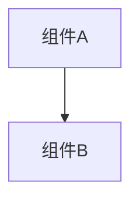

# 变更提案: fix-make-dev-auto-ports

## 元信息
```yaml
类型: 修复
方案类型: implementation
优先级: P0
状态: ✅通过
创建: 2026-02-24
```

---

## 1. 需求

### 背景
本地已有服务占用 `8000/3000` 时，虽然 `make dev BACKEND_PORT=...` 可绕开，但仍需要手动指定参数。期望仅执行一次 `make dev` 就能自动选择可用端口并把 backend / frontend / judge 三者联动到一致配置。

### 目标
- 仅执行 `make dev` 即可在端口被占用时自动选择可用端口并启动（无需用户加参数）
- 自动选择端口后，输出实际 URL，并保证 judge 与 frontend 都指向正确的 backend
- 行为可预测：优先使用默认端口，只有被占用时才递增尝试

### 约束条件
```yaml
时间约束: 无
性能约束: 无
兼容性约束: 不引入额外运行时依赖；仍可通过 `BACKEND_PORT/FRONTEND_PORT` 显式覆盖
业务约束: 禁止自动 kill 占用端口的进程（避免误伤）
```

### 验收标准
- [ ] 当 `8000` 被占用时，仅执行 `make dev` 会自动选择 `8001`（或下一个可用端口）并启动 backend
- [ ] 当 `3000` 被占用时，仅执行 `make dev` 会自动选择 `3001`（或下一个可用端口）并启动 frontend
- [ ] judge 的 MCP 连接与 frontend 的 `NEXT_PUBLIC_API_BASE_URL` 均指向实际选择后的 backend 端口

---

## 2. 方案

### 技术方案
在 `Makefile` 的 `dev` 目标中：
1) 将 `BACKEND_PORT/FRONTEND_PORT/BACKEND_HOST` 先复制为 shell 变量（避免 make-time 展开导致端口“无法动态修改”）  
2) 若默认端口不可用，则在固定范围内从基准端口开始递增寻找可用端口并采用（对外打印提示）  
3) 后续所有引用端口的地方统一使用 shell 变量（backend 启动、judge base、frontend base、提示输出）  

### 影响范围
```yaml
涉及模块:
  - Makefile/dev: 本地开发启动流程与端口选择策略
  - docs: 本地开发说明
预计变更文件: 2
```

### 风险评估
| 风险 | 等级 | 应对 |
|------|------|------|
| 自动选择端口可能让部分脚本/习惯依赖固定端口 | 低 | 默认优先固定端口，仅被占用时变更；并打印实际 URL |
| 端口扫描范围不足导致仍失败 | 低 | 给出明确错误提示，用户仍可显式覆盖端口 |

---

## 3. 技术设计（可选）

> 涉及架构变更、API设计、数据模型变更时填写

### 架构设计


### API设计
#### {METHOD} {路径}
- **请求**: {结构}
- **响应**: {结构}

### 数据模型
| 字段 | 类型 | 说明 |
|------|------|------|
| {字段} | {类型} | {说明} |

---

## 4. 核心场景

> 执行完成后同步到对应模块文档

### 场景: {场景名称}
**模块**: {所属模块}
**条件**: {前置条件}
**行为**: {操作描述}
**结果**: {预期结果}

---

## 5. 技术决策

> 本方案涉及的技术决策，归档后成为决策的唯一完整记录

### fix-make-dev-auto-ports#D001: 端口占用时自动选择“下一个可用端口”，但不自动 kill 占用进程
**日期**: 2026-02-24
**状态**: ✅采纳
**背景**: 只执行一次 `make dev` 需要解决端口冲突；但自动终止占用进程存在误伤风险。
**选项分析**:
| 选项 | 优点 | 缺点 |
|------|------|------|
| A: 快速失败 + 提示用户手动改端口 | 行为可预测 | 仍需用户加参数（不满足诉求） |
| B: 自动 kill 占用进程 | 一键跑通 | 误伤风险高（不可接受） |
| C: 自动选择下一个可用端口（推荐） | 一键跑通且风险低 | 端口变化需要提示用户 |
**决策**: 选择方案 C
**理由**: 满足“一条命令跑通”且避免 EHRB 风险。
**影响**: `Makefile` 的 `dev` 目标；本地开发文档说明
