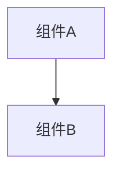

# 变更提案: fix-make-dev-port-diagnostics

## 元信息
```yaml
类型: 修复
方案类型: implementation
优先级: P0
状态: ✅通过
创建: 2026-02-24
```

---

## 1. 需求

### 背景
`make dev` 的默认端口 `8000/3000` 被占用时，最常见原因是本项目的 docker compose 栈（`realmoi-backend-1`）仍在运行并发布了 `8000`。此时自动改端口会导致“本地 dev 与 docker 栈并存”带来混淆（开发者以为自己在跑本地 8000，实际在跑 docker 8000）。

### 目标
- `make dev` 在端口被占用时直接失败，且明确告诉用户“是谁占用了端口”（至少提示 docker 容器/常见进程线索）
- 不再自动选择下一个端口，保持默认端口语义不变
- 保留显式端口覆盖能力（`BACKEND_PORT/FRONTEND_PORT`）

### 约束条件
```yaml
时间约束: 无
性能约束: 无
兼容性约束: 诊断信息仅作为提示，不能依赖 root 权限；避免引入新依赖
业务约束: 禁止自动停止/kill 占用端口的进程（避免误伤）
```

### 验收标准
- [ ] 当 `8000` 被占用时，`make dev` 直接失败并输出 docker/进程诊断信息（例如：`docker ps --filter publish=8000` 结果）
- [ ] 不再出现“自动改端口仍启动成功”的行为
- [ ] 文档与知识库同步更新，明确排障路径（docker compose down / stop 占用进程 / 显式覆盖端口）

---

## 2. 方案

### 技术方案
在 `Makefile` 的 `dev` 目标中：
1) 保留端口可用性预检查（bind 测试），端口不可用则直接失败  
2) 失败时输出诊断：`ps` 中常见可见线索（`--port {port}`、`docker-proxy -host-port {port}`），并在有 `docker` 时输出 `docker ps --filter publish={port}` 与（可选）`docker compose ps`  
3) 输出明确提示：如何释放端口（停止 docker compose 栈 / 停止占用进程）或如何显式覆盖端口重跑  

### 影响范围
```yaml
涉及模块:
  - Makefile/dev: 端口占用处理策略与诊断输出
  - docs: README + 知识库 backend 模块说明
预计变更文件: 4
```

### 风险评估
| 风险 | 等级 | 应对 |
|------|------|------|
| 非 root 下无法拿到完整 PID->端口映射 | 低 | 退化为 `ps` 线索 + docker 容器列表（最常见场景可覆盖） |
| 诊断命令不存在（如无 docker） | 低 | 用 `command -v` 检测后再执行，保证主流程不受影响 |

---

## 3. 技术设计（可选）

> 涉及架构变更、API设计、数据模型变更时填写

### 架构设计


### API设计
#### {METHOD} {路径}
- **请求**: {结构}
- **响应**: {结构}

### 数据模型
| 字段 | 类型 | 说明 |
|------|------|------|
| {字段} | {类型} | {说明} |

---

## 4. 核心场景

> 执行完成后同步到对应模块文档

### 场景: {场景名称}
**模块**: {所属模块}
**条件**: {前置条件}
**行为**: {操作描述}
**结果**: {预期结果}

---

## 5. 技术决策

> 本方案涉及的技术决策，归档后成为决策的唯一完整记录

### fix-make-dev-port-diagnostics#D001: 端口占用时“失败+诊断”，不自动改端口
**日期**: 2026-02-24
**状态**: ✅采纳
**背景**: 端口占用多为 docker compose 栈遗留；自动改端口会让本地与 docker 栈并存，导致排障与使用混乱。
**选项分析**:
| 选项 | 优点 | 缺点 |
|------|------|------|
| A: 自动选择下一个端口 | 更容易“跑起来” | 隐式行为导致混淆（尤其与 docker 栈并存） |
| B: 失败并输出诊断（推荐） | 行为可预测、语义稳定、易排障 | 需要用户释放端口后重跑 |
**决策**: 选择方案 B
**理由**: “默认端口语义稳定 + 明确告诉你是谁占用”比“悄悄换端口”更符合开发预期。
**影响**: `Makefile`、`README.md`、`helloagents/modules/backend.md`、`helloagents/CHANGELOG.md`
