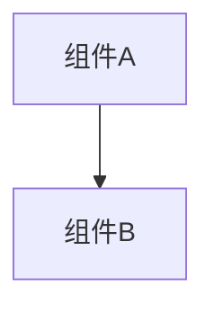

# 变更提案: fix-make-dev-start-judge

## 元信息
```yaml
类型: 修复
方案类型: implementation
优先级: P0
状态: ✅通过
创建: 2026-02-24
```

---

## 1. 需求

### 背景
默认端口被占用时，`make dev` 之前会直接失败（或需要手动换端口），导致独立 judge 不会被自动启动，开发流程被打断。常见场景是 backend 已通过 docker compose 启动并监听 `8000`，此时更合理的行为是复用现有 backend 并继续启动剩余组件（frontend/judge）。

### 目标
- `make dev` 在 `BACKEND_PORT` 已有监听时不再直接失败：复用现有 backend 并继续启动 frontend
- `make dev` 默认仍会确保独立 judge 运行：若本机/容器已存在 judge daemon 则复用，否则自动启动
- 不自动修改端口（保持端口语义稳定）

### 约束条件
```yaml
时间约束: 无
性能约束: 无
兼容性约束: 诊断与检测不依赖 root 权限；保持 `BACKEND_PORT/FRONTEND_PORT` 显式覆盖能力
业务约束: 禁止自动 kill 占用端口的进程/容器
```

### 验收标准
- [ ] backend 端口被占用但已有监听时：`make dev` 会输出“reusing”提示并继续启动 frontend
- [ ] `REALMOI_JUDGE_MODE=independent` 时：`make dev` 会输出 judge 状态（已运行/已启动）

---

## 2. 方案

### 技术方案
在 `Makefile` 的 `dev` 目标中：
1) 端口检测从“仅 bind 可用”升级为“可 bind 则启动；不可 bind 但可连接则复用监听”  
2) judge 进程启动前增加“是否已运行”的检测：已运行则跳过，否则启动，并把 `REALMOI_JUDGE_API_BASE_URL` 指向实际 backend 端口  
3) `wait` 逻辑改为仅等待本次启动的进程（避免 pid=0 导致等待策略异常）

### 影响范围
```yaml
涉及模块:
  - Makefile/dev: 本地开发启动编排
  - docs: README + 知识库 backend 模块说明
预计变更文件: 4
```

### 风险评估
| 风险 | 等级 | 应对 |
|------|------|------|
| 复用监听可能复用到“非本项目 backend” | 低 | 仅在用户明确使用默认端口时发生；若不符合预期可停止占用进程或显式覆盖端口 |

---

## 3. 技术设计（可选）

> 涉及架构变更、API设计、数据模型变更时填写

### 架构设计


### API设计
#### {METHOD} {路径}
- **请求**: {结构}
- **响应**: {结构}

### 数据模型
| 字段 | 类型 | 说明 |
|------|------|------|
| {字段} | {类型} | {说明} |

---

## 4. 核心场景

> 执行完成后同步到对应模块文档

### 场景: {场景名称}
**模块**: {所属模块}
**条件**: {前置条件}
**行为**: {操作描述}
**结果**: {预期结果}

---

## 5. 技术决策

> 本方案涉及的技术决策，归档后成为决策的唯一完整记录

### fix-make-dev-start-judge#D001: 端口不可 bind 但可连接时复用监听
**日期**: 2026-02-24
**状态**: ✅采纳
**背景**: 端口被占用常见原因是已有 backend（例如 docker compose）在监听。直接失败会阻断开发流程，也会导致 judge 无法自动启动。
**选项分析**:
| 选项 | 优点 | 缺点 |
|------|------|------|
| A: 端口占用直接失败 | 语义简单 | 阻断开发；judge 不启动 |
| B: 复用监听（推荐） | 单命令继续跑通 | 可能复用到非预期服务 |
**决策**: 选择方案 B
**理由**: 更符合“make dev 一键起环境”的目标，且保留显式端口覆盖作为兜底。
**影响**: `Makefile` 的 `dev` 目标；相关文档说明
