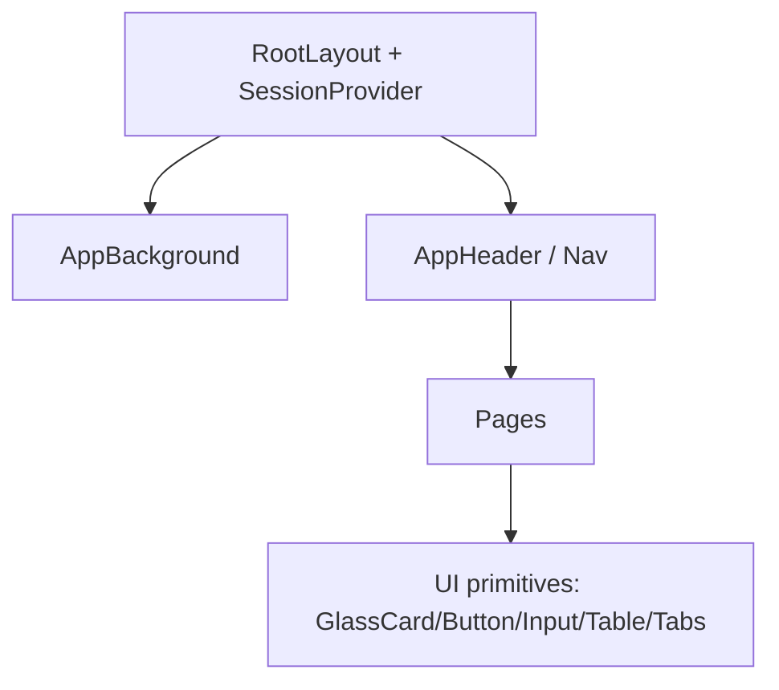

# 变更提案: liquid-glass-frontend-redesign

## 元信息
```yaml
类型: 设计
方案类型: overview
优先级: P0
状态: 设计完成（待实现）
创建: 2026-02-03
```

---

## 1. 需求

### 背景
当前前端功能已覆盖登录/注册、调题助手主页（Portal/Cockpit）、计费、Codex 设置、Admin 面板，但整体视觉风格不统一，且与“苹果液态玻璃”目标不匹配，影响产品质感与可用性（信息层级、密度、可读性）。

### 目标
- 全站前端统一为“苹果液态玻璃”风格：通透、简洁、清新明快，并兼顾可读性与性能。
- 一次性覆盖并重新设计所有现有路由页面（含 Admin 与登录/注册），导航栏功能齐全、可用。
- 不改变现有前后端接口与业务流程，仅做 UI/UX 层重构与组件整理。
- 当前阶段交付物：仅完成 Pencil 设计稿（不落地前端代码）。

### 约束条件
```yaml
时间约束: 无（一次性完成全站页面）
性能约束: 玻璃/模糊效果需控制层级与面积，避免大面积高斯模糊造成卡顿
兼容性约束: 以现代浏览器为主；backdrop-filter 不可用时需优雅降级（仍可读）
业务约束: 不改后端接口、不改鉴权语义；保留现有交互功能（SSE/xterm/产物下载等）
```

### 验收标准
- [√] （设计阶段）`designs/realmoi_ui.pen` 已包含全站各页面设计稿（逐页 frame），并体现 Liquid Glass（Portal/Cockpit 同款）风格
  - Frame 映射：`/login`→`k3cWg`，`/signup`→`CRZLi`，`/`→`nhqIS`（Portal）/`fvjH3`（Cockpit），`/billing`→`70be3`，`/settings/codex`→`5e8Tn`，`/admin/users`→`WfW7f`，`/admin/pricing`→`pU3eS`，`/admin/upstream-models`→`8972f`，`/admin/billing`→`Zq10u`
- [ ] （实现阶段）全站页面均采用统一的 Liquid Glass 视觉语言（背景、卡片、按钮、输入、表格、标签、状态提示）
- [ ] （实现阶段）页面清单覆盖：`/`（Portal/Cockpit 两种状态）、`/billing`、`/settings/codex`、`/admin/users`、`/admin/pricing`、`/admin/upstream-models`、`/admin/billing`、`/login`、`/signup`
- [ ] （实现阶段）导航栏包含所有入口（按权限显示/隐藏），且在各页面可正常跳转
- [ ] （实现阶段）主页调题助手 Portal/Cockpit、Job 详情 SSE 终端与状态、产物下载均正常可用
- [ ] （实现阶段）`frontend` 可通过 `npm run build` 与 `npm run lint`

---

## 2. 方案

### 技术方案
- 基于现有 Next.js(App Router) + TailwindCSS v4，不引入额外 UI 组件库；以现有 Portal/Cockpit（New Job + Job Detail）视觉语言为基准，将其扩展到登录/注册、账单、设置与 Admin 页面（保持同款背景/玻璃材质/排版层级）。
- 以 `AppHeader` 为全站导航中枢：主导航（主页/账单/设置）+ 管理员入口（下拉/分组），右侧用户信息与退出。
- 提供统一页面容器与“玻璃卡片/按钮/输入/表格/Tabs/提示条”等基础视觉样式；各页面仅做轻量组合与布局调整。
- xterm.js 终端容器切换为“深色玻璃面板”，Terminal theme 透明背景以融入玻璃容器。
- 同步产出 Pencil 设计稿 `designs/realmoi_ui.pen`：每个路由一张屏（必要时拆分子屏，如 Job Detail Tabs）。

### 影响范围
```yaml
涉及模块:
  - frontend: 全站 UI 重构（样式、导航、页面布局、终端展示）
  - designs: 新增/完善全站 UI 设计稿
预计变更文件: 20-40（以 UI 组件与页面为主）
```

### 风险评估
| 风险 | 等级 | 应对 |
|------|------|------|
| 玻璃/模糊造成性能下降 | 中 | 控制模糊强度与层数；避免全屏多层 backdrop-filter；为动画提供 reduced-motion 降级 |
| 视觉统一影响可读性（对比不足） | 中 | 以对比度为第一原则，使用明确的文本/边框/阴影层级；提供深色终端面板 |
| 改动范围大导致局部页面回归问题 | 中 | 逐页改造并跑 `build/lint`；保持接口与数据结构不变 |

---

## 3. 技术设计（可选）

> 不涉及 API/数据模型变更；本节仅记录 UI 架构与 token 设计。

### 架构设计


### 设计 Token（核心）
```yaml
色彩:
  - 背景: 柔和渐变 + 光晕
  - 玻璃面: 半透明 + 细边框 + 高光
  - 强调色: Indigo/Blue（按钮、选中态、进度）
层级:
  - Surface 1: 普通玻璃卡片
  - Surface 2: 强玻璃（登录卡/重要面板）
  - Surface 3: 深色玻璃（终端）
交互:
  - hover: 轻微提亮/阴影增强
  - active: 轻微下压/高光减弱
  - focus: 低强度 ring（可访问性）
```

---

## 4. 核心场景

> 执行完成后同步到对应模块文档

### 场景: 全站导航与权限显示
**模块**: frontend
**条件**: 已登录；Session 已加载
**行为**: 顶部导航展示主要入口；管理员额外展示 Admin 分组入口；点击可跳转
**结果**: 用户可从任意页面返回主页/账单/设置；管理员可进入 Users/Pricing/Upstream Models/Admin Billing

---

## 5. 技术决策

> 本方案涉及的技术决策，归档后成为决策的唯一完整记录

### liquid-glass-frontend-redesign#D001: 不引入 UI 组件库，使用 Tailwind v4 + CSS 变量实现 Liquid Glass
**日期**: 2026-02-03
**状态**: ✅采纳
**背景**: 需要全站一致的液态玻璃风格，且尽量降低依赖与迁移成本。
**选项分析**:
| 选项 | 优点 | 缺点 |
|------|------|------|
| A: 引入第三方 UI 库（如 shadcn/radix 等） | 组件丰富、交互成熟 | 依赖增多、样式与现有 Tailwind v4 适配成本高、主题定制复杂 |
| B: Tailwind v4 + CSS 变量（自研少量 primitives） | 改动可控、风格一致、与现有代码贴合 | 需要自行维护基础组件与样式规范 |
**决策**: 选择方案 B
**理由**: 在不改变功能的前提下，最小成本实现统一风格，且更易保持与现有代码一致。
**影响**: frontend 全站样式与组件、designs 设计稿

### liquid-glass-frontend-redesign#D002: 终端采用“深色玻璃面板 + xterm 透明背景”融合方案
**日期**: 2026-02-03
**状态**: ✅采纳
**背景**: Job 详情页终端需要更高对比与更强“专业工具感”，同时仍保持玻璃风格一致。
**选项分析**:
| 选项 | 优点 | 缺点 |
|------|------|------|
| A: 终端保持纯白卡片 | 统一 | 可读性差、缺少层级、终端观感不佳 |
| B: 深色玻璃容器 + xterm 透明背景 | 对比好、质感强、融入全局风格 | 需要额外 theme 配置与 CSS 适配 |
**决策**: 选择方案 B
**理由**: 终端属于高密度信息区域，应优先可读性与对比，同时维持材质一致。
**影响**: `/`（Cockpit 状态）页面与相关样式

### liquid-glass-frontend-redesign#D003: 全站样式以现有 Portal/Cockpit（New Job + Job Detail）为基准
**日期**: 2026-02-03
**状态**: ✅采纳
**背景**: 用户明确希望全站样式与当前 “New Job + Job 内对话详情（Cockpit）” 一致，不另起一套视觉语言。
**选项分析**:
| 选项 | 优点 | 缺点 |
|------|------|------|
| A: 从零定义全站新 token 与组件 | 灵活、可塑性强 | 容易与已验证的 Portal/Cockpit 产生偏差；实现/回归成本更高 |
| B: 以 Portal/Cockpit 为 SSOT，其他页面对齐 | 一致性强、风险低、落地更快 | 需要整理并抽象出可复用的“玻璃 primitives”以避免重复 |
**决策**: 选择方案 B
**理由**: 以已验证的关键路径样式为基准，能最快达到“清新明快 + 液态玻璃”质感，同时降低后续落地的不确定性。
**影响**: `designs/realmoi_ui.pen` 设计稿与后续前端实现策略
